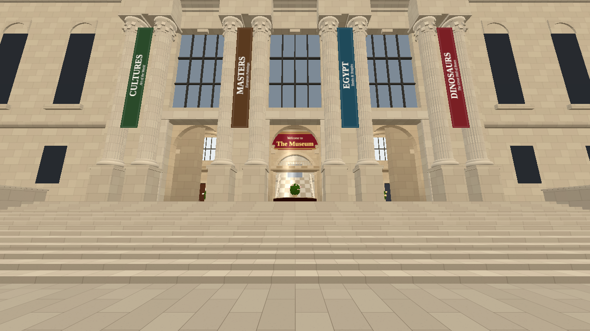

# The Museum

A 2–4 player WebXR game set after hours in a grand New York museum. Quest Browser first, desktop second. One museum, four game modes; **Capture the Relic** is playable now.

The full spec is in [docs/BRIEF.md](docs/BRIEF.md). Status is in [docs/PROGRESS.md](docs/PROGRESS.md), and design decisions are in [docs/DECISIONS.md](docs/DECISIONS.md).



## Prerequisites

- Node.js 22 (npm 10)
- For screenshots and smoke tests: Chromium for Playwright (`npx playwright install chromium`, or set `CHROMIUM_PATH`)

## Run it locally

```bash
npm install
npm run dev
```

This builds `shared/`, then runs three things together:

| Process | URL |
|---|---|
| Colyseus server | http://localhost:2567 (health check: `/health`) |
| Vite client | http://localhost:5173 |
| `shared/` type build in watch mode | n/a |

Open http://localhost:5173 and click **Start a party**. That takes you to `/party/<slug>`. Send that link to a friend, or open it in a second browser window. Nobody types a room code.

**Desktop controls**

| Key | Action |
|---|---|
| WASD + mouse | Move and look |
| Shift | Sprint |
| C | Crouch |
| E / Q | Grab or drop with the right / left hand |
| Click | Punch, bonk or throw |
| F | Shove |
| Tab / Esc | Personal menu |
| F3 or ` | Perf HUD |

**VR controls (Quest)**

| Control | Action |
|---|---|
| Left stick | Move (click the stick to sprint) |
| Right stick | Snap turn |
| Grip | Grab; release while moving to throw |
| Swing your hands | Punch glass, shove players |
| Hold Y for half a second, or poke the left-wrist button | Personal menu |
| Trigger | Click world-space UI |

### Environment variables

| Variable | Where | Default | Purpose |
|---|---|---|---|
| `VITE_SERVER_URL` | client (build time) | `<page host>:2567` | Server URL or bare host. A bare host is treated as `https://`. |
| `PORT` | server | `2567` | Listen port (Render sets this). |
| `CLIENT_ORIGIN` | server | allow any | Comma-separated client origins or hosts allowed by CORS. |
| `MUSEUM_TUNABLES` | server | none | JSON overrides for `shared/src/config/tunables.ts`. Used for tests and server-side tuning. |

Copy `client/.env.example` to `client/.env` to point a local client at another server.

### URL flags

| Flag | Effect |
|---|---|
| `?offline` | Museum only, no server |
| `?cam=<bookmark>` | Jump to a camera bookmark (see `client/src/debug/bookmarks.ts`) |
| `?room=<roomId>` | Start inside a room |
| `?mode=ctr` | Host preselects a mode |
| `?perf` | Perf HUD |
| `?spectate` | Free-fly camera |
| `?quality=quest\|desktop\|desktop-high` | Force a quality tier |
| `?nomusic` | Start with music off |
| `?buttons` | Show the controller button-index readout on the wrist |

## Testing on a Quest

WebXR needs a secure context: HTTPS, or `localhost`.

- **USB (easiest).** Enable developer mode on the headset, connect it, then run `adb reverse tcp:5173 tcp:5173 && adb reverse tcp:2567 tcp:2567`. Open `http://localhost:5173` in Quest Browser. Because it is `localhost`, it counts as secure.
- **Wi-Fi.** Serve over HTTPS, for example with a tunnel such as `cloudflared tunnel --url http://localhost:5173`. Point `VITE_SERVER_URL` at a second tunnel for port 2567.
- **Deployed build.** Use the Render URL (below). It is HTTPS out of the box.

After each milestone, run the checklist in [docs/HEADSET_TESTS.md](docs/HEADSET_TESTS.md).

**Desktop XR emulator.** Install the "Immersive Web Emulator" browser extension (Meta) to drive the VR code path on desktop. It does not replace a headset test.

## Tests and tools

```bash
npm run check           # typecheck + lint + unit/bot tests + route rule
npm test                # Vitest: CTR rules, map integrity, headless bot matches
npm run measure-routes  # fast / tactical / hidden route lengths (brief §6.3)
npm run screens         # capture every camera bookmark to docs/screens/ (dev server running)
npm run smoke           # two browsers join one party, see each other, start a round
```

`tools/smoke/hunt-desktop.ts`, `tools/smoke/crowd-desktop.ts`, `tools/smoke/fraud-desktop.ts` and `tools/smoke/movement-desktop.ts` cover Artifact Hunt, Crowd Control, Insurance Fraud, and walking, sprinting, stairs and elevators. `tools/smoke/ctr-desktop.ts` plays a full Capture the Relic round in two real browsers on desktop controls. The setup commands are in its header.

### Asset scripts

- `npm run fetch-art` pulls about 120 public-domain (CC0) works from the Met Collection API. It packs atlases into `client/public/assets/art/` and writes `docs/CREDITS-art.md`. Until you run it, the galleries show procedural placeholder canvases with the same data shape.
- `client/public/assets/manifest.json` maps logical ids to files. Set a `model.skeleton.*` entry's `file` to a CC0 `.glb` (for example a Smithsonian 3D scan) and it replaces the procedural skeleton. No code changes needed.

## Deploy to Render

The repo includes a Blueprint, `render.yaml`. It defines a Node web service for the server and a static site for the client.

1. Push to GitHub.
2. In Render, choose **New → Blueprint** and select this repo. Render reads `render.yaml` and creates `the-museum-server` and `the-museum-client`.
3. The Blueprint wires the client's `VITE_SERVER_URL` to the server's host. Optionally, once deployed, set `CLIENT_ORIGIN` on the server to the client URL to restrict CORS.
4. Deploy. Open the client URL, start a party, and share the `/party/<slug>` link.

**Free vs paid.** Free web services sleep after about 15 minutes idle. They take a while to wake, and in-memory parties are lost on restart. The client shows "Waking the museum…" and retries. An old party link recreates the party under the same slug, so links never dead-end. For real play sessions, use a paid instance so the server stays awake.

## Repository layout

```
shared/   map data, tunables, protocol, pure rules (CTR, combat) + tests
server/   Colyseus PartyRoom, shared systems, modes (ctr, tour) + bot tests
client/   Three.js + WebXR client: world kit, player, multiplayer, UI, audio
tools/    route measurement, screenshots, smoke tests, Met art fetcher
docs/     brief, progress, decisions, headset checklist, credits, screenshots
```

The building is an original design inspired by a grand New York museum. It is not affiliated with, and does not depict, the Metropolitan Museum of Art.
